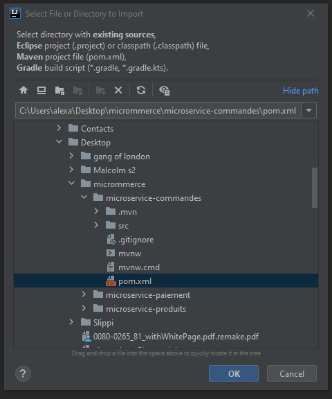
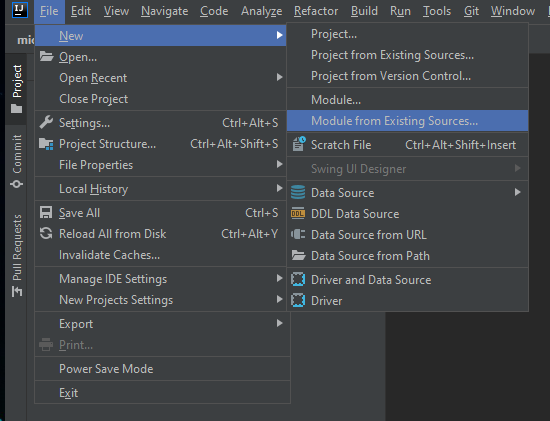

# Microservices with Spring Cloud Simple Demo Project [](https://twitter.com/sherlock2045)


In this project I'm demonstrating you the most interesting features of [Spring Cloud Project](https://spring.io/projects/spring-cloud) for building microservice-based architecture.

## Getting Started
Currently you may find here some examples of microservices implementation using different projects from Spring Cloud.
1.  Using Spring Cloud Netflix **Eureka** as a discovery server, **Zuul** as a gateway, **OpenFeign** for communication and Spring Cloud Config Server.
2. Using Spring Cloud Netflix **Ribbon** as client side load balancer
3. Using Spring **Security** for securing microservices
4. Using Spring Cloud **Sleuth** and **Zipkin** for tracing
5. Using Spring Boot **actuator** for debugging
### Usage

Clone the repository on your local environment
```shell
$ git clone https://github.com/SherlockHolmes2045/micro-ecommerce
```

We are going to use IntelliJ Idea to run the project.
Once the project is cloned, click "Import Project", then select the "microservice-commandes" folder. Select "Create a project from existing sources" and select a pom:


Then select Module from Existing Sources:

And select pom.xml of each other modules (eureka-server,microservice-expedition,microservice-paiement,etc)


In the most cases you need to have Maven and JDK8+.The best way to run the sample applications is with IDEs like IntelliJ IDEA or Eclipse.

## Architecture

Our sample microservices-based system consists of the following modules:
- **gateway-service** - a module that Spring Cloud Netflix Zuul for running Spring Boot application that acts as a proxy/gateway in our architecture.(zuul-server)
- **config-service** - a module that uses Spring Cloud Config Server for running configuration server in the `native` mode(config-server). The configuration files are placed in the config-server-repo folder.
- **discovery-service** - a module that depending on the example it uses Spring Cloud Netflix Eureka (eureka-server).
- **clientui** - a module calling all of our microservices to render data and doing client side load balancing with Netflix Ribbon.
- **microservice-produits** - a module containing the first of our sample microservices that allows to perform CRUD operation on in-memory repository of product
- **microservice-commande** - a module containing the first of our sample microservices that allows to perform CRUD operation on in-memory repository of orders. It communicates with microservice-produits.
- **microservice-expedition** - a module containing the second of our sample microservices that allows to perform CRUD operation on in-memory repository of expiditions. It communicates with microservice-commande.
- **microservice-paiement** - a module containing the third of our sample microservices that allows to perform CRUD operation on in-memory repository of payments. It communicates with both microservice-commande and microservice-paiement.

## Tracing 
Since version 2 of Spring Boot, the Zipkin server is no longer included by default, and cannot be easily added via a starter.

So we're going to [download](https://repo1.maven.org/maven2/io/zipkin/java/zipkin-server/2.6.1/zipkin-server-2.6.1-exec.jar) Zipkin and launch it like a regular JAR file.

Once downloaded, launch it via the command:
```shell
$ java -jar /path/to/zipkin-server-2.6.1-exec.jar
```

Once launched, go to the URL http://localhost:9411 to view the Zipkin home page.